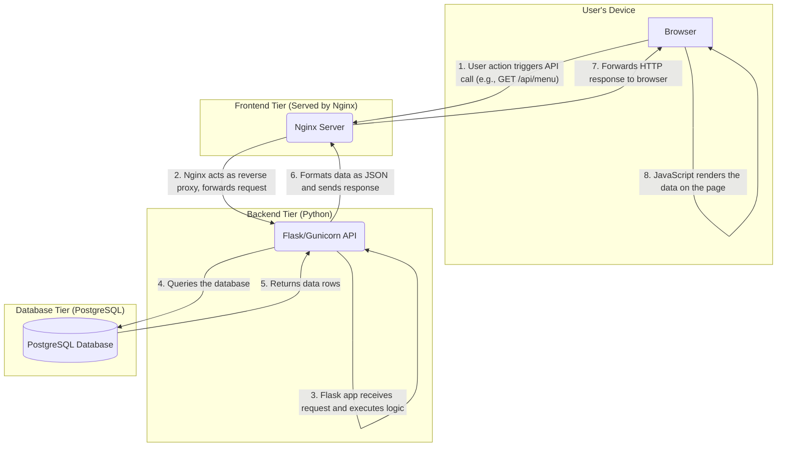

# Current State Specification & Flowchart

This document outlines the current architecture and request flow of the 3-Tier POS Web Application.

## Architecture Flowchart

The following flowchart illustrates the interaction between the different components of the application when a user makes a request to an API endpoint (e.g., fetching the menu).

